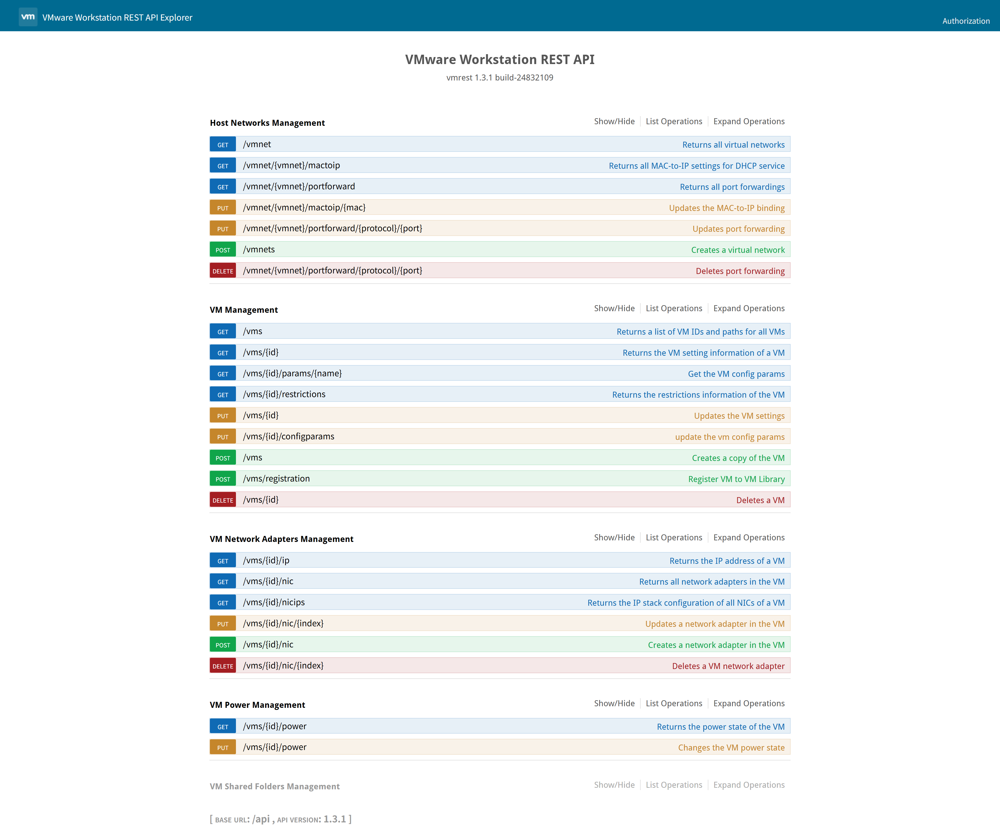

# VMware Workstation Pro MCP Server

<div align="center" id="top">
  </img>
</div>
</p>

<p align="center">
<a href="https://pypi.org/project/vmware-workstation-pro-mcp-server/"></a>
<a href="https://pypi.org/project/vmware-workstation-pro-mcp-server/"></a>
<a href="https://github.com/gandli/vmware-workstation-pro-mcp-server/issues"></a>
<a href="https://pypi.org/project/vmware-workstation-pro-mcp-server"></a>
<a href="https://github.com/gandli/vmware-workstation-pro-mcp-server/blob/main/LICENSE"></a>
</p>

通过 **REST API** 管理 VMware Workstation Pro 虚拟机的 **MCP (Model Context Protocol)** 服务器。

---

## 功能

* 主机网络管理
* 虚拟机管理
* 网络适配器管理
* 虚拟机电源控制
* 共享文件夹管理

---

## 前置条件

* **需要 VMware Workstation 14 或更高版本**（启用 REST API）
* **Python 3.10+**
* **[uv](https://github.com/astral-sh/uv)**（推荐）或 **pip**

---

## 使用方法

### 1. 配置 VMware Workstation Pro REST API

```pwsh
.\vmrest.exe -C
VMware Workstation REST API
Copyright (C) 2018-2025 Broadcom.
All Rights Reserved

vmrest 1.3.1 build-24832109
Username: user
New password:
Retype new password:
Processing...
Credential updated successfully
```

### 2. 启动 VMware Workstation Pro REST API

```pwsh
cd "C:\Program Files (x86)\VMware\VMware Workstation"
.\vmrest.exe
VMware Workstation REST API
Copyright (C) 2018-2025 Broadcom.
All Rights Reserved
vmrest 1.3.1 build-24832109
-
Using the VMware Workstation UI while API calls are in progress is not recommended and may yield unexpected results
-
Serving HTTP on 127.0.0.1:8697
-
Press Ctrl+C to stop.
```

默认服务地址：`http://localhost:8697`




---

### 3. 配置 MCP Server

```json
"vmware-workstation-pro": {
  "isActive": true,
  "name": "vmware-workstation-pro",
  "type": "stdio",
  "command": "uvx",
  "args": [
    "vmware-workstation-pro-mcp-server"
  ],
  "env": {
    "VMREST_USER": "user",
    "VMREST_PASS": "Password123!"
  }
}
```

---

## MCP 工具说明

### `list_vms`

* **说明:** 列出所有虚拟机
* **参数:** 无

### `get_vm_info`

* **说明:** 获取指定虚拟机的详细信息
* **参数:**

  * `vm_id` *(string)*：虚拟机 ID

### `power_vm`

* **说明:** 控制虚拟机电源状态
* **参数:**

  * `vm_id` *(string)*：虚拟机 ID
  * `action` *(string)*：操作类型，可选值为 `"on"`, `"off"`, `"suspend"`, `"pause"`, `"unpause"`, `"reset"`

### `get_vm_power_state`

* **说明:** 查询虚拟机的电源状态
* **参数:**

  * `vm_id` *(string)*：虚拟机 ID

---

## 参考资料

* [VMware Fusion MCP Server](https://github.com/yeahdongcn/vmware-fusion-mcp-server)
* [FastMCP 文档](https://gofastmcp.com/)
* [Model Context Protocol](https://modelcontextprotocol.io/)
* [uvx](https://github.com/modelcontextprotocol/uvx)
* [Fetch Server 示例](https://github.com/modelcontextprotocol/servers/tree/main/src/fetch)
* [VMware Workstation REST API 文档](https://developer.broadcom.com/xapis/vmware-workstation-pro-api/latest/)

## Star History

[](https://www.star-history.com/#gandli/vmware-workstation-pro-mcp-server&type=date&legend=bottom-right)
